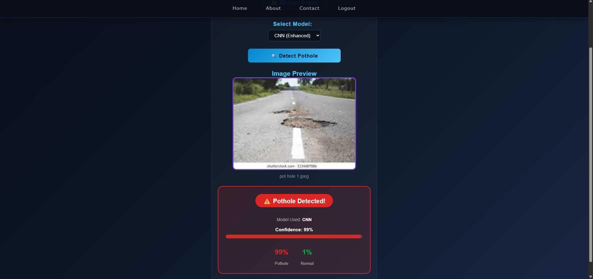

# 🚧 Pothole Detection System

An AI-powered full-stack web application that detects potholes in road images using deep learning models (CNN and ANN), built with React.js, Flask, Node.js, and MongoDB.

---

## 🎯 What It Does

Upload a road image → choose an AI model → get instant prediction on whether a pothole is present, along with a confidence score.

---

## 🖥️ Demo


> Upload a road image, select ANN or CNN model, and the system returns:
> - ✅ **Prediction**: Pothole / Normal
> - 📊 **Confidence Score**: e.g. 0.87
> - 🔢 **Class Probabilities**: `{ Pothole: 0.87, Normal: 0.13 }`

---

## 🛠️ Tech Stack

| Layer | Technology |
|-------|-----------|
| Frontend | React.js, HTML, CSS |
| AI/ML Backend | Python, Flask, PyTorch |
| App Backend | Node.js, Express.js |
| Database | MongoDB |
| AI Models | Custom CNN, ANN (PyTorch) |

---

## 🧠 AI Models

### 1. Enhanced CNN (Convolutional Neural Network)
A custom-built 4-layer CNN trained on road images:
- 4 Convolutional layers with BatchNorm and ReLU activation
- MaxPooling for spatial reduction
- Fully connected layers with Dropout (0.5) to prevent overfitting
- Sigmoid output for binary classification

```
Input Image (64x64 grayscale)
        ↓
Conv Layer 1 (32 filters) + BatchNorm + ReLU + MaxPool
        ↓
Conv Layer 2 (64 filters) + BatchNorm + ReLU + MaxPool
        ↓
Conv Layer 3 (128 filters) + BatchNorm + ReLU + MaxPool
        ↓
Conv Layer 4 (256 filters) + BatchNorm + ReLU + MaxPool
        ↓
Fully Connected (512 neurons) + Dropout
        ↓
Output → Pothole / Normal + Confidence Score
```

### 2. ANN (Artificial Neural Network)
A simpler neural network model for comparison against the CNN.

---

## 📁 Project Structure

```
PotHoleDetection/
│
├── client/                  # React.js frontend
│   ├── src/                 # React components
│   ├── public/              # Static assets
│   └── package.json
│
├── flask_server/            # Python AI backend
│   ├── app.py               # Flask API routes
│   ├── enhanced_cnn.py      # CNN model definition & inference
│   ├── ann.py               # ANN model definition & inference
│   ├── model.pth            # Trained CNN model weights
│   └── model2.pth           # Trained ANN model weights
│
├── server/                  # Node.js backend
│   ├── controllers/         # Route controllers
│   ├── middlewares/         # Auth middlewares
│   ├── model/               # MongoDB schemas
│   ├── routes/              # API routes
│   └── index.js             # Server entry point
│
└── README.md
```

---

## ⚙️ How It Works

```
User uploads road image via React frontend
        ↓
Node.js server handles authentication (MongoDB)
        ↓
Image sent to Flask API (/predict endpoint)
        ↓
User's chosen model (CNN or ANN) processes image
        ↓
Result returned: Prediction + Confidence Score
        ↓
Displayed on frontend
```

---

## 🔧 Installation & Setup

### Prerequisites
- Python 3.x
- Node.js & npm
- MongoDB (running on localhost:27010)

### 1. Clone the repository
```bash
git clone https://github.com/Sri-Lohith-Mulugu/PotHoleDetection.git
cd PotHoleDetection
```

### 2. Start the Flask AI Server
```bash
cd flask_server
pip install flask flask-cors torch torchvision pillow
python app.py
```

### 3. Start the Node.js Backend
```bash
cd server
npm install
npm start
```

### 4. Start the React Frontend
```bash
cd client
npm install
npm start
```

### 5. Open in browser
```
http://localhost:3000
```

---

## 🔌 API Reference

### POST `/predict`
Accepts a road image and returns pothole detection result.

**Request:**
- `image` — road image file
- `model` — `"CNN"` or `"ANN"`

**Response:**
```json
{
  "model": "CNN",
  "result": {
    "prediction": "Pothole",
    "confidence": 0.87,
    "class_probabilities": {
      "Pothole": 0.87,
      "Normal": 0.13
    }
  }
}
```

---

## 🌍 Real-World Applications

- 🏙️ **Smart City Infrastructure** — automate road damage reporting
- 🚗 **Autonomous Vehicles** — real-time road hazard detection
- 📱 **Mobile Reporting Apps** — citizens report potholes instantly
- 🛣️ **Road Maintenance** — prioritize repairs based on AI detection

---

## 🧠 What I Learned

- Building and training custom CNN architecture using PyTorch
- Creating REST APIs with Flask and enabling CORS for cross-origin requests
- Connecting a React frontend with multiple backends (Flask + Node.js)
- User authentication with Node.js, Express and MongoDB
- Comparing ANN vs CNN performance for image classification tasks

---

## 👥 Project Info

Developed as a personal project exploring computer vision and full-stack development.

---

## 📄 License

This project is for educational purposes.
